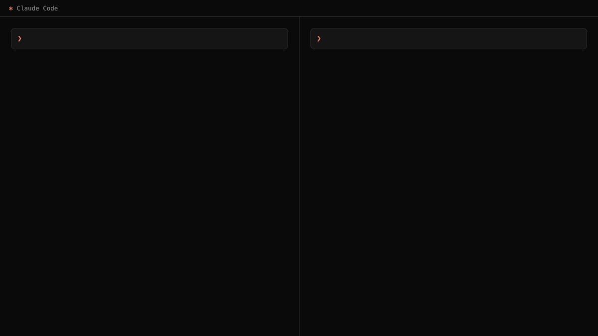

# Expert

**Domain experts on call.**

Expert is a skill for Claude Code that summons 1–3 domain experts — fields, schools of thought, named people — so your task gets opinionated, in-character reads instead of one balanced-into-mush answer.



*The reads in the demo are excerpts from a real `/expert` run — the skill picked Burkeman, Clear, and Freud from the index on its own.*

## Usage

- `do X for me` — direct, as usual.
- `/expert why do I keep putting off things I actually want to do?` — it picks the experts that fit (in the demo run: Oliver Burkeman, James Clear, Sigmund Freud) and gives their reads first.
- `/expert security, look at this diff` — name the expert yourself; works even if they're not in the base.
- `/expert add behavioral economics` — discovery mode: propose and save new experts for a topic.

## Install

It's a plain folder-skill.

**Let Claude do it** — paste to Claude Code:

> Install the skill from https://github.com/xtompie/expert into `~/.claude/skills/expert`

**Or yourself:**

```bash
git clone https://github.com/xtompie/expert.git ~/.claude/skills/expert
```

Restart the session and `/expert` is available. Update with `git pull` in that folder. It has `disable-model-invocation: true`, so it never runs on its own — only when you type `/expert`.

## What's an expert?

A **perspective with domain knowledge**: a field (behavioral psychology), a school of thought (stoicism), or a named person (Sigmund Freud). Unlike a generic thinking lens, an expert *brings* domain vocabulary, frameworks, and opinions — that's the point.

Ask *"why do I keep putting off things I actually want to do?"* directly and you get one voice, one angle. Ask `/expert` and the experts read it each their own way — from the same run as the demo: **`oliver-burkeman`**: *you put it off precisely because you want it — the finite, imperfect real version kills the perfect fantasy version; readiness is not coming.* **`james-clear`**: *no cue, no two-minute version, phone three centimeters from your hand — it's a design flaw, not a character flaw.* **`sigmund-freud`**: *ask not "why can't I start" but "what does never finishing protect me from?" — the delay keeps the wish alive and avoids the verdict.* Then it shows where they disagree and closes with a short synthesis and a menu (another expert, the web, execute, sub-agents).

Experts are opinionated by design. The balance comes from picking **multiple** experts and letting them disagree — the disagreement is signal, not noise.

## Where experts come from

Expert looks in three places:

- **The model's own head** — it knows far more experts than the folder holds; the folder is a menu and a memory, not a boundary.
- **The base** — 138 experts and growing: ~87 role archetypes (software-architect, ux-researcher, discovery-coach, pentester…) and ~51 thinkers with named apparatuses (Jung, Munger, Taleb, Hayek, Popper, Drucker, the Stoics…).
- **The web** — only when you ask — to find who the recognized experts are for this kind of problem.

When an expert played from the head genuinely helps, Expert offers to save them to the base, with a check against duplicates and an anti-hallucination guard for real people (thin knowledge → generalize to the school, or research first). The base grows from use.

## What's in the repo

- `SKILL.md` — the process: pick experts, embody them (or spawn as sub-agents), grow the base. No domain knowledge.
- `INDEX.md` — the expert menu: one row per expert — name + field + when to use.
- `experts/*.md` — each expert in 15–30 lines: `name` / `field` / `when` / `when_not` + Voice, Core ideas, the questions they ask, and what they never let slide.
- `FIELDS.md` — coverage checklist used to grow the thinkers axis field by field.

The model reads the INDEX and loads only the few experts that fit a task, not the whole set.

## Sibling project

[Prism](https://github.com/xtompie/prism) — same mechanics (index + short files + write-back loop), different content: generic thinking lenses instead of domain experts. Use Prism to change the angle, Expert to bring the domain.
